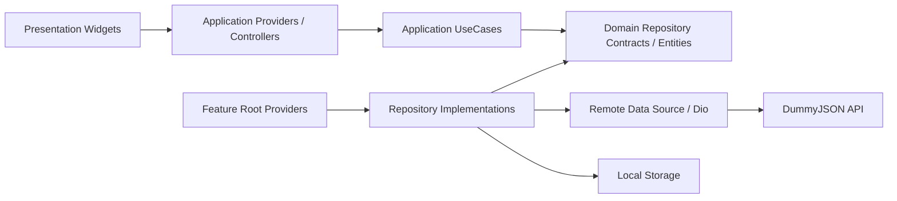
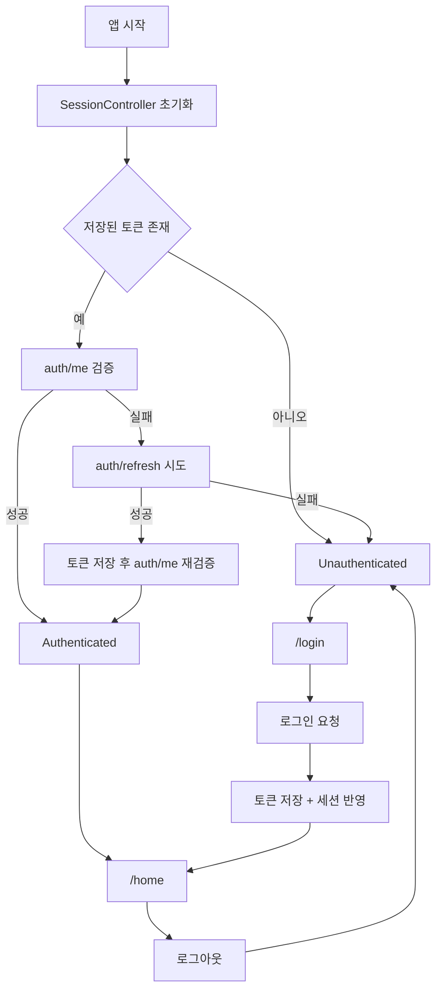

# Riverpod Origin Template

Riverpod 3, `go_router`, `dio`, `freezed`, `json_serializable` 기반의 정석형 Flutter 프로젝트 템플릿입니다.  
예제 시나리오는 `스플래시 -> 세션 복구 -> 로그인 -> 홈` 이며, 인증과 목록 API 는 `https://dummyjson.com/` 을 사용합니다.

상세 구조 설명과 새 API 추가 방법은 [docs/PROJECT_GUIDE.md](./docs/PROJECT_GUIDE.md) 에 정리되어 있습니다.
AI agent 작업 규칙은 [AGENTS.md](./AGENTS.md) 에 정리되어 있습니다.

## 기술 스택

- `flutter_riverpod` + `riverpod_generator`
- `go_router`
- `dio`
- `freezed` + `json_serializable`
- `usecase` + repository pattern
- `flutter_secure_storage`(모바일) / `shared_preferences`(웹)

## 실행 방법

```bash
flutter pub get
dart run build_runner build --delete-conflicting-outputs
flutter run --dart-define=API_BASE_URL=https://dummyjson.com
```

개발 중에는 아래 watch 명령을 함께 쓰면 편합니다.

```bash
dart run build_runner watch --delete-conflicting-outputs
```

환경별 진입점:

```bash
flutter run -t lib/main_development.dart
flutter run -t lib/main_staging.dart
flutter run -t lib/main_production.dart
```

환경별 기본 설정값은 [app_flavors.dart](./lib/core/config/app_flavors.dart) 에서 한 번에 관리합니다.

## 예제 계정

- username: `emilys`
- password: `emilyspass`

예제 화면 문구, 샘플 계정, DummyJSON 인증 옵션은 [template_example.dart](./lib/core/config/template_example.dart) 에 모아 두었습니다. 실제 프로젝트로 전환할 때는 이 파일과 각 feature datasource 구현을 먼저 교체하면 됩니다.

## 디렉터리 구조

```text
lib/
  app/
    router/
      route_modules/
    theme/
    widgets/
  core/
    config/
    errors/
    logging/
    network/
    presentation/
    result/
    storage/
  features/
    auth/
      auth_providers.dart
      application/
        usecases/
      data/
        datasources/
        models/
        repositories/
      domain/
        entities/
        repositories/
        value_objects/
      presentation/
    home/
      home_providers.dart
      application/
        usecases/
      data/
        datasources/
        models/
        repositories/
      domain/
        entities/
        repositories/
      presentation/
test/
  auth/
  home/
  router/
  helpers/
assets/
  images/
  icons/
```

자산 경로 상수는 [app_assets.dart](./lib/core/config/app_assets.dart) 에 두었습니다. 이미지 추가 시 `AppAssets.image('logo.png')`, 아이콘 추가 시 `AppAssets.icon('app_icon.png')` 형태로 바로 연결할 수 있습니다.

## 아키텍처 원칙

- `presentation` 은 provider 를 구독하고 사용자 이벤트만 전달합니다.
- `application` 은 controller/provider 와 usecase 로 화면 흐름, side effect 를 관리합니다.
- `domain` 은 엔티티, value object, repository 계약만 가지며 DTO/JSON/storage/network 타입을 직접 알지 않습니다.
- `data` 는 DTO, remote/local datasource, repository 구현을 가집니다.
- feature 루트의 composition provider 가 repository 구현체를 조립하고, usecase provider 는 필요 시 `core` provider 와 함께 의존성을 주입받습니다.
- controller 는 repository 를 직접 호출하지 않고 usecase 만 호출합니다.
- usecase 실패는 `AppFailure` 로 정규화하고, UI 는 이 계약만 직접 해석합니다.
- 읽기 전용 목록도 확장 가능성을 위해 `AsyncNotifier` controller 패턴을 사용합니다.

## 아키텍처 흐름도



## 런타임 플로우



## 예제 기능

- `auth/login`, `auth/me`, `auth/refresh` 연동
- 세션 복구 및 인증 라우트 가드
- 네트워크 오류 시 세션 토큰 보존 및 splash 재시도
- authenticated shell route 기반 확장 구조
- `APP_ENV`, `API_BASE_URL` 기반 환경 분리와 비생산 배너
- `ProviderObserver` 및 네트워크 로깅 훅
- bootstrap 전역 에러 처리 및 monitoring 확장 포인트
- 홈에서 현재 사용자 정보 출력
- `products` 목록 조회와 pull-to-refresh

## 환경값

- `API_BASE_URL`
  - 환경별 기본값은 `lib/core/config/app_flavors.dart` 에서 관리
  - 필요 시 `--dart-define=API_BASE_URL=...` 로 일시 override 가능
- `APP_ENV`
  - 기본값: `dev`
  - 지원값: `dev`, `staging`, `prod`

## 환경 배너 확인

- 비생산 환경에서는 우상단에 현재 실행 환경을 표시하는 배너가 보입니다.
- `dev` 에서는 `DEV`, `staging` 에서는 `STAGING` 이 표시됩니다.
- `prod` 에서는 배너가 표시되지 않습니다.

실행 예시:

```bash
flutter run --dart-define=APP_ENV=dev
flutter run --dart-define=APP_ENV=staging
flutter run --dart-define=APP_ENV=prod
```

`APP_ENV` 를 지정하지 않으면 기본값은 `dev` 입니다.

## 플랫폼 메모

- 웹은 `PathUrlStrategy` 를 사용하므로 배포 서버에서 모든 경로를 `index.html` 로 rewrite 해야 합니다.
- 모바일은 `flutter_secure_storage` 기준으로 설정되어 있습니다.
- Android 는 보안 저장소 기본 옵션에 맞춰 `minSdk 23` 으로 상향했습니다.
- iOS 는 Keychain 저장을 위해 entitlements 를 추가했습니다.

## 권장 작업 흐름

1. feature 단위로 `presentation/application/domain/data` 구조를 복제합니다.
2. 새 API 가 필요하면 `data/models` DTO, `domain/entities`, `domain/repositories`, `data/datasources`, `data/repositories` 순서로 추가합니다.
3. repository 구현체 조립은 `<feature>_providers.dart` 에서 하고, controller 는 usecase 만 호출합니다.
4. 마지막에 `presentation`, route, test 를 연결합니다.
5. 화면에서 직접 `Dio` 를 호출하지 않고 provider 와 repository 계약을 통해 접근합니다.

## 스타터킷 확장 기준

- 현재 구조는 소형/중형 프로젝트에 바로 적합합니다.
- 현재 템플릿은 이미 `app/router/route_modules` 를 사용해 route 조립을 분리하고 있습니다.
- protected feature 가 늘어나면 기존 module 에 route 를 추가하거나 feature 단위 module 을 계속 분리하는 방식으로 확장합니다.
- 기준:
  인증 후 화면이 2~3개 feature 를 넘기기 시작하면 `app_router.dart` 한 파일에 세부 route 정의를 누적하지 않고 feature 단위 route 조립으로 유지합니다.
