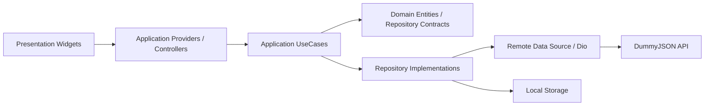
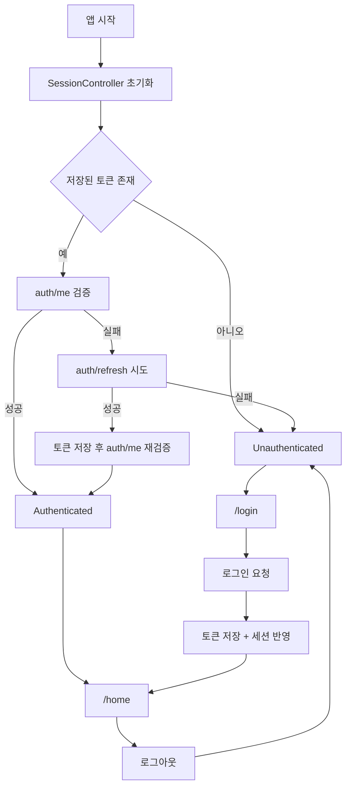

# Riverpod Origin Template

Riverpod 3, `go_router`, `dio`, `freezed`, `json_serializable` 기반의 정석형 Flutter 프로젝트 템플릿입니다.  
예제 시나리오는 `스플래시 -> 세션 복구 -> 로그인 -> 홈` 이며, 인증과 목록 API 는 `https://dummyjson.com/` 을 사용합니다.

상세 구조 설명과 새 API 추가 방법은 [docs/PROJECT_GUIDE.md](./docs/PROJECT_GUIDE.md) 에 정리되어 있습니다.
AI agent 작업 규칙은 [AGENTS.md](./AGENTS.md) 에 정리되어 있습니다.

## 기술 스택

- `flutter_riverpod` + `riverpod_generator`
- `go_router`
- `dio`
- `freezed` + `json_serializable`
- `usecase` + repository pattern
- `flutter_secure_storage`(모바일) / `shared_preferences`(웹)

## 실행 방법

```bash
flutter pub get
dart run build_runner build --delete-conflicting-outputs
flutter run --dart-define=API_BASE_URL=https://dummyjson.com
```

개발 중에는 아래 watch 명령을 함께 쓰면 편합니다.

```bash
dart run build_runner watch --delete-conflicting-outputs
```

## 예제 계정

- username: `emilys`
- password: `emilyspass`

## 디렉터리 구조

```text
lib/
  app/
    router/
    theme/
  core/
    config/
    network/
    presentation/
    storage/
  features/
    auth/
      application/
        usecases/
      data/
      domain/
      presentation/
    home/
      application/
        usecases/
      data/
      domain/
      presentation/
```

## 아키텍처 원칙

- `presentation` 은 provider 를 구독하고 사용자 이벤트만 전달합니다.
- `application` 은 controller/provider 와 usecase 로 화면 흐름, side effect 를 관리합니다.
- `domain` 은 엔티티와 repository 계약만 가집니다.
- `data` 는 DTO, remote/local datasource, repository 구현을 가집니다.
- feature 루트의 composition provider 가 구현체를 조립하고, `application` 은 그 provider 를 통해서만 의존성을 받습니다.
- controller 는 repository 를 직접 호출하지 않고 usecase 만 호출합니다.
- 읽기 전용 목록도 확장 가능성을 위해 `AsyncNotifier` controller 패턴을 사용합니다.

## 아키텍처 흐름도



## 런타임 플로우



## 예제 기능

- `auth/login`, `auth/me`, `auth/refresh` 연동
- 세션 복구 및 인증 라우트 가드
- 네트워크 오류 시 세션 토큰 보존 및 splash 재시도
- authenticated shell route 기반 확장 구조
- `APP_ENV`, `API_BASE_URL` 기반 환경 분리와 비생산 배너
- `ProviderObserver` 및 네트워크 로깅 훅
- 홈에서 현재 사용자 정보 출력
- `products` 목록 조회와 pull-to-refresh

## 환경값

- `API_BASE_URL`
  - 기본값: `https://dummyjson.com`
  - 필요 시 `--dart-define=API_BASE_URL=...` 로 교체
- `APP_ENV`
  - 기본값: `dev`
  - 지원값: `dev`, `staging`, `prod`

## 환경 배너 확인

- 비생산 환경에서는 우상단에 현재 실행 환경을 표시하는 배너가 보입니다.
- `dev` 에서는 `DEV`, `staging` 에서는 `STAGING` 이 표시됩니다.
- `prod` 에서는 배너가 표시되지 않습니다.

실행 예시:

```bash
flutter run --dart-define=APP_ENV=dev
flutter run --dart-define=APP_ENV=staging
flutter run --dart-define=APP_ENV=prod
```

`APP_ENV` 를 지정하지 않으면 기본값은 `dev` 입니다.

## 플랫폼 메모

- 웹은 `PathUrlStrategy` 를 사용하므로 배포 서버에서 모든 경로를 `index.html` 로 rewrite 해야 합니다.
- 모바일은 `flutter_secure_storage` 기준으로 설정되어 있습니다.
- Android 는 보안 저장소 기본 옵션에 맞춰 `minSdk 23` 으로 상향했습니다.
- iOS 는 Keychain 저장을 위해 entitlements 를 추가했습니다.

## 권장 작업 흐름

1. feature 단위로 `presentation/application/domain/data` 구조를 복제합니다.
2. 새 API 가 필요하면 `data/models`, `datasources`, `repositories` 에서부터 추가합니다.
3. 화면에서 직접 `Dio` 를 호출하지 않고 provider 와 repository 계약을 통해 접근합니다.
